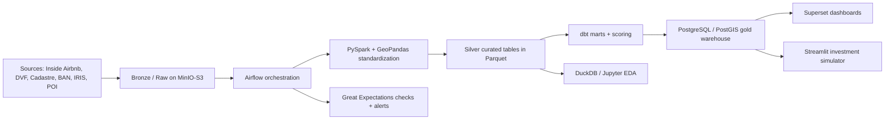

# Cadrage de projet big data / data engineering / data science

> Archive: ce cadrage etait centre sur `Airbnb + DVF`. Le projet actif a ete recentre vers la **location saisonniere rurale et touristique**. Voir [cadrage_projet_location_saisonniere_rurale_touristique.md](cadrage_projet_location_saisonniere_rurale_touristique.md).

## Identifier les meilleures zones géographiques pour investir dans un projet Airbnb en France

Ce document propose un cadrage complet, techniquement crédible et orienté business pour construire une plateforme analytique capable d'identifier, comparer et scorer les meilleures zones d'investissement Airbnb en croisant données locatives courte durée, transactions immobilières, foncier et enrichissements géospatiaux.

---

## 1. Definition precise du probleme

### Reformulation du besoin metier
Un investisseur veut savoir **ou acheter ou developper un bien** pour maximiser la rentabilite d'un projet Airbnb tout en maitrisant le risque. La decision ne doit pas se limiter au prix du bien: elle doit croiser **coût d'entree**, **revenu locatif potentiel**, **taux d'occupation estime**, **stabilite saisonniere**, **pression concurrentielle** et **contraintes locales**.

### Trois niveaux d'objectif
- **Objectif business**: classer les zones geographiques les plus interessantes selon plusieurs profils investisseurs et justifier le choix par des KPI de rentabilite et de risque.
- **Objectif analytique**: construire une vue consolidee par zone et par periode combinant Airbnb, immobilier, foncier, attractivite et signaux geospatiaux.
- **Objectif technique**: mettre en place une pipeline reproductible de type lakehouse/warehouse, avec ingestion, qualite, transformations, scoring et visualisation.

### Niveaux d'analyse recommandes
- **Commune**: niveau lisible pour le metier et utile pour la restitution executive.
- **IRIS**: niveau pertinent pour la micro-analyse urbaine quand les donnees sont suffisantes.
- **Cellule H3**: niveau analytique ideal pour lisser l'anonymisation des positions Airbnb et faire des cartes fines.
- **Section cadastrale**: utile pour rapprocher foncier et parcelles, mais a utiliser avec prudence pour Airbnb a cause du floutage geographique.
- **Departement / region**: utile pour comparer les tendances de marche et les regimes touristiques.

Recommandation: produire les marts a trois granularites principales: **H3**, **IRIS**, **commune**.

---

## 2. Hypotheses metier et limites

### Hypotheses metier principales
- Le **taux de remplissage Airbnb** n'est pas observe directement. Il peut etre **estime** via le calendrier, la disponibilite et les reviews.
- Le **revenu locatif potentiel** est une estimation, pas un chiffre comptable. Il depend d'hypotheses sur le prix reellement pratique, la duree moyenne de sejour, les nuits bloquees et les frais.
- Le **prix d'acquisition** doit distinguer:
  - prix du terrain,
  - prix du bati,
  - prix total d'acquisition,
  - frais annexes,
  - cout de construction hypothetique si l'actif cible est un terrain.

### Estimation du taux de remplissage
Trois approches sont possibles:
- **Calendrier**: `occupancy_proxy = 1 - available_nights / open_nights`, limite: les jours bloques par l'hote ne sont pas distingues des jours reserves.
- **Reviews**: estimer les reservations a partir des reviews et d'un `review_to_booking_rate`, limite: fort biais de comportement client.
- **Modele hybride**: combiner calendrier, reviews, fraicheur de l'annonce et activite recente. C'est l'option la plus defendable.

### Biais et limites a expliciter
- **Legislation locale**: declaration, compensation, changement d'usage, quotas ou restrictions locales peuvent rendre une zone economiquement attractive mais juridiquement contrainte.
- **Saisonnalite**: stations balneaires, montagne, grandes villes et zones d'affaires ont des profils tres differents.
- **Floutage des coordonnees Airbnb**: les points Inside Airbnb sont anonymises, donc la parcelle exacte n'est pas fiable.
- **Heterogeneite du parc**: comparer un studio urbain avec une villa littorale peut etre trompeur si l'analyse n'est pas segmentee.
- **Temporalite des ventes DVF**: une vente de 2021 ne reflete pas toujours le marche 2025-2026.
- **Terrain vs bien existant**: un terrain n'est investissable qu'avec hypothese de constructibilite, cout de construction, delai et reglement d'urbanisme.
- **Donnees manquantes ou bruit**: superficie, nombre de chambres, minimum nights, prix texte, outliers, doublons.

---

## 3. Jeux de donnees et schema de fusion

### Datasets cibles

| Dataset | Granularite | Frequence | Variables cles | Limites | Cle / jointure |
| --- | --- | --- | --- | --- | --- |
| Inside Airbnb `listings` | annonce | snapshots periodiques selon ville | `id`, `host_id`, `latitude`, `longitude`, `room_type`, `accommodates`, `bedrooms`, `price`, `minimum_nights`, `number_of_reviews`, `availability_365` | coordonnees floutees, couverture par villes uniquement | `listing_id`, point geo, H3, IRIS, commune |
| Inside Airbnb `calendar` | annonce-jour | snapshot futur sur 365 jours | `listing_id`, `date`, `available`, `price`, `adjusted_price`, `minimum_nights`, `maximum_nights` | un jour indisponible n'est pas necessairement reserve | `listing_id` + date |
| Inside Airbnb `reviews` | review | snapshots periodiques | `listing_id`, `date`, texte review | pas de valeur monetaire directe | `listing_id` + temps |
| DVF Etalab | transaction | mise a jour semestrielle, historique glissant 5 ans | `date_mutation`, `valeur_fonciere`, `type_local`, `surface_reelle_bati`, `surface_terrain`, `code_commune`, `adresse`, `id_parcelle` | geocodage incomplet selon cas, ventes anciennes, multi-lots | `id_parcelle`, `code_commune`, point geo, IRIS |
| DVF+ / Statistiques DVF / datafoncier | zone ou transaction enrichie | regulier selon source | prix median au m2, agrégats par zone, temporalite | agregats parfois deja lisses, moins fins que DVF brute | commune, IRIS, section, carreau |
| Cadastre Etalab | parcelle / batiment / feuille | millesimes infra-annuels | geometries de parcelles, sections, bati, contenance | volumineux, qualite variable selon territoires | `id_parcelle`, `section`, intersection spatiale |
| BAN | adresse / point | quasi quotidien | adresse, `id`, `x`, `y`, `citycode`, `postcode` | qualite variable selon adresse | normalisation adresses, geocodage |
| IRIS / ADMIN EXPRESS | zone administrative | ponctuel / annuel | codes INSEE, libelles, geometries | pas de niveau micro-adresse | `code_iris`, `code_commune` |
| INSEE BPE / equipements / OSM / GTFS | POI / ligne | annuel a frequent selon source | gares, aeroports, plages, commerces, loisirs, sante | couverture heterogene | buffers, distance, densite |
| Tourisme / evenements / meteo | zone-temps | mensuel ou evenementiel | flux touristiques, nuitées, meteo, vacances scolaires, evenements | depend de la source | commune/date ou departement/date |

### Schema de fusion realiste
1. **Airbnb listings** sert de reference offre.
2. **Calendar** fournit le signal quotidien prix/disponibilite.
3. **Reviews** apporte un signal d'activite et de demande.
4. **DVF** apporte le coût d'entree immobilier ou foncier.
5. **Cadastre** enrichit la structure parcellaire et le contexte foncier.
6. **IRIS / commune / H3** servent de couches de convergence.
7. **POI / transports / tourisme** servent d'enrichissements explicatifs.

### Jointures
- **Jointure directe**:
  - `listings.id = calendar.listing_id`
  - `listings.id = reviews.listing_id`
- **Jointure administrative**:
  - `point -> IRIS -> commune -> departement -> region`
- **Jointure geospatiale**:
  - `ST_Intersects(point, polygon)`
  - `ST_DWithin(point, poi, buffer_meters)`
  - H3/geohash commun entre points et zones agregees
- **Jointure fonciere**:
  - DVF vers parcelle via `id_parcelle` quand disponible
  - sinon rapprochement adresse + BAN + commune

### Regle importante
Pour Airbnb, **ne pas chercher une jointure parcelle-a-annonce exacte**. A cause du floutage Inside Airbnb, il faut raisonner en **zone agrégée**: H3, IRIS, quartier, commune.

---

## 4. Architecture technique du projet

### Stack recommandee: moderne, serieuse, mais encore faisable seul
- **Stockage brut / lake**: `MinIO` en local ou `S3` en cloud.
- **Formats**: `Parquet` + partitionnement temporel et geographique.
- **Traitement batch**: `PySpark` pour les gros volumes, `Pandas/GeoPandas` pour les enrichissements localises.
- **Warehouse geospatial**: `PostgreSQL + PostGIS`.
- **SQL analytique local**: `DuckDB` pour l'EDA et le prototypage rapide.
- **Orchestration**: `Airflow`.
- **Transformation analytique**: `dbt` sur Postgres ou DuckDB pour les marts.
- **Data quality**: `Great Expectations` ou `Soda`.
- **Visualisation**: `Superset` pour le BI, `Streamlit` pour le simulateur investisseur.
- **Exploration**: `JupyterLab`.
- **Versionnement / reproducibilite**: `Git`, `Docker Compose`, `pre-commit`, optionnellement `DVC`.

### Pourquoi cette stack
- Elle couvre **ingestion, transformation, qualite, geospatial, BI et demo**.
- Elle est **credible en soutenance** sans imposer un cloud couteux.
- Elle permet une trajectoire simple vers le cloud:
  - `MinIO -> S3`
  - `Postgres -> BigQuery/Snowflake`
  - `Superset -> Power BI/Tableau/Looker`

### Architecture logique



### Couches data
- **Bronze**: donnees brutes versionnees, sans logique metier.
- **Silver**: donnees nettoyees, standardisees, geocodees et historisees.
- **Gold**: marts analytiques, KPI, tables de scoring, vues dashboard.

---

## 5. Modele de donnees

### Modele cible
Un **modele en etoile** pour le gold, alimente par une couche silver orientee entites.

### Tables de faits

| Table | Grain | Mesures principales |
| --- | --- | --- |
| `fact_airbnb_listing_daily` | 1 annonce x 1 jour | prix nuit, disponibilite, prix ajuste, minimum nights |
| `fact_airbnb_listing_monthly` | 1 annonce x 1 mois | ADR, disponibilite moyenne, revenu estime, reviews recents |
| `fact_airbnb_zone_monthly` | 1 zone x 1 mois | ADR zone, occupancy estimee, RevPAR, densite d'offre, concurrence |
| `fact_real_estate_transactions` | 1 mutation DVF | valeur fonciere, surface bati, surface terrain, prix m2 bati, prix m2 terrain |
| `fact_zone_real_estate_monthly` | 1 zone x 1 mois ou trimestre | prix median m2, nb mutations, volatilite, tendance |
| `fact_investment_score` | 1 zone x 1 profil x 1 date de calcul | score final, rentabilite, risque, rang |

### Dimensions

| Dimension | Colonnes cles |
| --- | --- |
| `dim_location` | `location_key`, `h3_cell`, `code_iris`, `code_commune`, `departement`, `region`, `lat`, `lon`, `geom` |
| `dim_time` | `date_key`, jour, semaine, mois, trimestre, annee, saison, vacances_scolaires |
| `dim_property_type` | `room_type`, `type_local`, `capacity_band`, `surface_band` |
| `dim_listing` | `listing_key`, `listing_id`, `host_id`, `room_type`, `accommodates`, `bedrooms`, `bathrooms`, `minimum_nights` |
| `dim_zone_features` | score transport, score urbanite, densite POI, distance gare, distance aeroport, prox plage, altitude |
| `dim_regulation` | type de contrainte, niveau de restriction, date d'effet, source |

### Colonnes et metriques clefs
- `price_per_night_eur`
- `available_flag`
- `booked_nights_est`
- `occupancy_rate_est`
- `gross_revenue_est_month`
- `gross_revenue_est_year`
- `purchase_price_est_m2`
- `land_price_est_m2`
- `gross_yield_est`
- `payback_years_est`
- `competition_index`
- `risk_score`
- `investment_score`

---

## 6. Pipeline data engineering

### Etapes de pipeline
1. **Collecte**
   - telechargement Inside Airbnb par ville ou territoire couvert,
   - recuperation DVF brute,
   - recuperation cadastre, BAN, IRIS, POI.
2. **Normalisation**
   - encodages UTF-8,
   - types de colonnes,
   - devises et nombres,
   - dates ISO,
   - noms de colonnes snake_case.
3. **Nettoyage**
   - suppression des doublons,
   - gestion des outliers,
   - filtrage des annonces inactives,
   - correction des superficies impossibles.
4. **Enrichissement geographique**
   - geocodage DVF si necessaire,
   - H3 sur tous les points,
   - rattachement IRIS/commune,
   - distances aux POI et scores de voisinage.
5. **Calculs metier**
   - prix m2 bati et terrain,
   - ADR et RevPAR,
   - occupation estimee,
   - revenu estime,
   - concurrence,
   - score final.
6. **Aggregation**
   - mensuelle, trimestrielle, annuelle,
   - par H3, IRIS, commune, departement.
7. **Validation**
   - schema checks,
   - tests de nullite,
   - bornes numeriques,
   - coherence geographique,
   - freshness.

### Logique incrementale
- **Inside Airbnb**: charger par `snapshot_date` et `city`.
- **Calendar**: partition `snapshot_date/year/month`.
- **DVF**: partition par `year` de `date_mutation`.
- **Faits gold**: recalcul incrementaux par `month_key` et `zone_key`.
- Garder des **snapshots historises** pour les comparaisons temporelles.

### Strategie de partitionnement
- Bronze: `source=/dataset=/snapshot_date=`
- Silver: `dataset=/year=/month=`
- Gold: `mart=/zone_level=/year=/month=`

### Controles qualite a imposer
- unicite `listing_id + snapshot_date`
- unicite `transaction_id` si construit
- `price_per_night_eur > 0`
- `surface_reelle_bati >= 0`
- `occupancy_rate_est between 0 and 1`
- `prix_m2` borne par quantiles robustes
- coordonnees dans l'emprise France ou ville cible
- taux de matching geo par lot de chargement

### Exemples de transformations SQL

```sql
with cleaned_calendar as (
    select
        listing_id,
        cast(date as date) as stay_date,
        case when available = 't' then 1 else 0 end as is_available,
        cast(regexp_replace(coalesce(adjusted_price, price), '[^0-9.,]', '', 'g') as numeric) as raw_price
    from bronze_airbnb_calendar
),
normalized as (
    select
        listing_id,
        stay_date,
        is_available,
        replace(raw_price::text, ',', '.')::numeric as price_eur
    from cleaned_calendar
)
select * from normalized;
```

```sql
select
    l.zone_key,
    date_trunc('month', d.stay_date) as month_key,
    avg(d.price_eur) filter (where d.is_available = 0) as adr_est,
    1 - avg(d.is_available::numeric) as occupancy_calendar_proxy,
    avg(d.price_eur) * (1 - avg(d.is_available::numeric)) as revpar_proxy
from fact_airbnb_listing_daily d
join dim_listing l on l.listing_key = d.listing_key
group by 1, 2;
```

### Exemple PySpark

```python
from pyspark.sql import functions as F

calendar = (
    spark.read.parquet("s3a://lake/bronze/airbnb/calendar/")
    .withColumn("stay_date", F.to_date("date"))
    .withColumn("available_flag", F.when(F.col("available") == "t", F.lit(1)).otherwise(F.lit(0)))
    .withColumn(
        "price_eur",
        F.regexp_replace(F.coalesce("adjusted_price", "price"), r"[^0-9,\\.]", "").cast("double")
    )
)

zone_month = (
    calendar.groupBy("h3_cell", F.date_trunc("month", "stay_date").alias("month_key"))
    .agg(
        F.avg("price_eur").alias("avg_price_eur"),
        (F.lit(1) - F.avg("available_flag")).alias("occupancy_calendar_proxy"),
    )
)
```

### Note d'implementation
Pour les distances, surfaces et buffers, stocker en `EPSG:4326` mais calculer en `EPSG:2154` pour la France metropolitaine.

---

## 7. Variables et features a construire

### Offre Airbnb
- prix moyen par nuit
- prix median par nuit
- `availability_30`, `availability_90`, `availability_365`
- nombre de reviews total et recent
- anciennete de l'annonce
- type de logement
- capacite, chambres, salle de bain
- minimum nights
- densite d'offres concurrentes dans le voisinage

### Demande / performance estimee
- taux de remplissage estime
- revenu potentiel mensuel et annuel
- saisonnalite par mois
- tendance sur 3, 6, 12 mois
- variance et coefficient de variation du revenu
- fraicheur des reviews

### Immobilier / foncier
- prix median du bati au m2
- prix median du terrain au m2
- nb de transactions recentes
- volatilite du marche immo local
- delai moyen depuis derniere transaction comparable
- ratio prix annonce / prix de zone

### Geospatial / attractivite
- distance au centre-ville
- distance a une gare TGV
- distance a un aeroport
- proximite plages, stations, monuments, ski, centres d'affaires
- densite de restaurants, commerces, loisirs, culture
- score transport
- score urbanite
- score premium
- score vue / littoral / montagne si derive

### Reglementaire et risque
- niveau de contrainte meublés touristiques
- niveau de concurrence
- stabilite de revenu
- sparsity du signal data
- sensibilite a la saison

---

## 8. Indicateurs business a calculer

Soit:
- `P_night` = prix moyen par nuit
- `N_booked_est` = nuits reservees estimees
- `N_open` = nuits ouvertes a la vente
- `C_entry` = cout total d'entree
- `R_gross_year` = revenu brut annuel estime
- `CF_net_year` = cash-flow net annuel estime

### KPI
- **ADR**: `ADR = total_revenue_booked / booked_nights`
- **Occupancy rate estime**: `Occ_est = N_booked_est / N_open`
- **RevPAR**: `RevPAR = ADR * Occ_est`
- **Revenu brut mensuel estime**: `R_gross_month = ADR * booked_nights_est_month`
- **Revenu brut annuel estime**: `R_gross_year = sum(R_gross_month sur 12 mois)`
- **Yield brut**: `Yield_gross = R_gross_year / C_entry`
- **Yield net**: `Yield_net = CF_net_year / C_entry`
- **Payback period**: `Payback = C_entry / CF_net_year`
- **Ratio revenu / prix achat**: `R_gross_year / purchase_price_total`
- **Ratio revenu / prix terrain**: `R_gross_year / land_price_total`
- **Rentabilite par zone**: moyenne ou mediane des yields des actifs comparables de la zone
- **Niveau de risque**: score composite de volatilite, concurrence, regulation et qualite data
- **Score d'opportunite**: score multicritere normalise sur 100

### Cout total d'entree
Pour un bien existant:
`C_entry = prix_achat + frais_notaire + travaux + ameublement + frais_acquisition`

Pour un terrain:
`C_entry = prix_terrain + cout_construction_hyp + VRD + frais_notaire + frais_permis + marge_imprevus`

---

## 9. Analyse exploratoire a produire

| Graphe | Ce qu'il montre | Interpretation |
| --- | --- | --- |
| Carte des prix Airbnb | gradient spatial de `ADR` | identifier poches premium et zones sous-prixees |
| Carte des prix fonciers / bati | prix m2 DVF par zone | comparer coût d'entree et potentiel locatif |
| Heatmap de rentabilite | `yield`, `RevPAR`, score par zone | faire apparaitre les zones cibles |
| Distribution des prix Airbnb | histogrammes / KDE | verifier asymetrie et segments de marche |
| Boxplots par type de logement | studio, appart, maison, chambre | isoler les differents modeles economiques |
| Prix/nuit vs occupancy | scatter plot | voir si le marche punit ou recompense le premium |
| Evolution temporelle des prix | serie mensuelle | lire tendance, chocs et saisonnalite |
| Correlogramme | correlation des variables | guider le feature engineering |
| Clustering de zones | projection PCA/UMAP | identifier familles de marches |
| Analyse des outliers | points aberrants | detecter erreurs data ou micro-marches atypiques |
| Courbes de saisonnalite | mois x taux d'occupation / ADR | mesurer stabilite annuelle |

### EDA indispensable
- segmenter au minimum par **type de logement**, **taille**, **ville/zone** et **saison**;
- comparer **zone premium**, **zone rendement** et **zone budget**;
- utiliser une echelle log pour prix et revenus si la distribution est tres asymetrique.

---

## 10. Partie geospatiale

### Principes geospatiaux
- normaliser les points en WGS84 (`EPSG:4326`);
- reprojeter en Lambert-93 (`EPSG:2154`) pour distances, surfaces et buffers;
- construire une **grille H3** pour lisser le bruit et comparer les zones;
- effectuer les aggregations a plusieurs resolutions.

### Recommandations H3
- `res 8`: vue macro urbaine
- `res 9`: bon compromis quartier / precision
- `res 10`: precision plus fine, a reserver aux zones denses

### Analyses geospatiales utiles
- jointure `point in polygon` vers IRIS/commune
- buffers de 500 m, 1 km, 5 km autour des gares, plages, aeroports, stations, POI
- densite d'offres Airbnb par cellule
- densite d'equipements par cellule
- distances minimales aux hubs de transport
- choropleth + hexbin interactifs

### Visualisations cartographiques
- carte choropleth IRIS/commune
- couche H3 coloree par `ADR`, `yield`, `risk_score`
- deck.gl kepler.gl ou pydeck pour navigation fluide
- filtres temporels et selection multi-zones

---

## 11. Partie data science / machine learning

### 1. Regression du prix Airbnb
- **Cible**: `log(price_per_night_eur)`
- **Features**: type logement, capacite, reviews, score quartier, distances, saison, concurrence
- **Modeles**: Linear/ElasticNet, Random Forest, XGBoost, CatBoost
- **Metriques**: MAE, RMSE, MAPE
- **Usage**: estimer le prix plausible d'un bien ou d'une zone sans historique complet

### 2. Regression du taux de remplissage
- **Cible**: `occupancy_rate_est`
- **Features**: prix, reviews, disponibilite, saison, attractivite, concurrence, minimum_nights
- **Metriques**: MAE, RMSE, calibration par decile
- **Limite**: la cible est estimee, donc le modele apprend un proxy

### 3. Scoring multicritere
- **Objet**: recommander des zones, pas seulement predire
- **Entrees**: rentabilite, occupation, stabilite, coût, concurrence, risque, regulation
- **Sortie**: score par zone et par profil

### 4. Clustering non supervise
- **But**: typologiser les marches: urbain premium, balneaire saisonnier, montagne haut rendement, rural faible concurrence
- **Methodes**: KMeans, GMM, HDBSCAN
- **Sortie**: label interpretable pour le dashboard et la soutenance

### 5. Detection d'anomalies
- listings sous-prices ou sur-prices
- zones dont la rentabilite apparente est probablement un artefact data
- methodes: Isolation Forest, LOF, robust z-score

### 6. Simulation d'investissement
- input utilisateur: budget, surface, cible de rendement, frais, occupation
- output: cash-flow, payback, sensibilite aux hypotheses

---

## 12. Construction d'un score final d'investissement

### Formule de base

`Score = 100 * (alpha * Rentabilite_norm + beta * Occupation_norm + gamma * Stabilite_norm + eta * Attractivite_norm - delta * Cout_entree_norm - epsilon * Concurrence_norm - zeta * Risque_norm)`

### Normalisation
- utiliser un **min-max robuste** sur quantiles 5-95 ou un **rank percentile**
- tronquer les extremes
- calculer les scores **par segment comparable**: type de logement, zone urbaine vs touristique, budget

### Choix des poids
- **manuel**: definition metier explicite selon le profil investisseur
- **expertise**: ateliers avec broker, hote ou analyste immobilier
- **analyse de sensibilite**: varier les poids et mesurer la stabilite du top 10
- **optimisation**: si on a des retours historiques, choisir les poids qui reproduisent au mieux la performance observee

### Recommandation pratique
Construire **deux scores**:
- un **score rendement**
- un **score robuste**

Puis exposer les deux et un **score composite profilable**.

---

## 13. Cas d'usage final

### Sortie metier attendue
**Top 10 des zones les plus prometteuses pour lancer un Airbnb**, avec justification:
- `zone`
- `ADR_est`
- `occupancy_est`
- `gross_yield_est`
- `payback_est`
- `risk_score`
- `main_strength`
- `main_warning`

### Profils investisseurs

| Profil | Poids forts | Logique |
| --- | --- | --- |
| Prudent | stabilite, risque faible, regulation, liquidite | privilegie les marches urbains profonds et reguliers |
| Rendement | yield, occupation, coût d'entree bas | accepte plus de volatilite |
| Premium | ADR, attractivite, potentiel haut de gamme | cible quartiers centraux ou zones touristiques premium |
| Petit budget | faible ticket d'entree, ratio revenu/prix | cherche micro-marches accessibles |

### Personnalisation
Chaque profil modifie:
- les **poids du score**,
- les **contraintes budgetaires**,
- les **hypotheses de travaux / ameublement**,
- le **niveau de risque acceptable**.

---

## 14. Stack de restitution

### Livrable 1: rapport technique
Structure suggeree:
1. contexte et enjeux
2. sources et limites
3. architecture data
4. modele de donnees
5. pipeline et qualite
6. EDA
7. modeles et scoring
8. resultats business
9. limites et suites

### Livrable 2: dashboard interactif
Pages recommandees:
- **Vue France**: carte, filtres, classement
- **Comparateur de zones**: 2 a 5 zones cote a cote
- **Zone detail**: prix Airbnb, prix m2, saisonnalite, concurrence, POI
- **Simulation investissement**: budget, frais, scenario occupancy
- **Modele / explainability**: decomposition du score et feature importance

### Composants dashboard
- KPI cards
- cartes interactives
- series temporelles
- ranking
- histogrammes / boxplots
- filtres par profil, budget, region, type de logement

---

## 15. Industrialisation

### Vision production
- ingestion automatisee par DAG Airflow
- refresh mensuel ou semestriel selon source
- logs, alertes et freshness checks
- environnement Docker Compose pour dev
- CI avec tests unitaires, SQL tests dbt, linting
- documentation auto: `README`, dictionnaire de donnees, lineage
- versionnement des datasets et des snapshots
- parametrage par YAML ou `.env`

### Monitoring minimal
- nombre de lignes ingerees
- taux de nulls par colonne critique
- taux de matching geo
- evolution des distributions
- presence d'outliers
- date de derniere mise a jour par source

### Deploiement
- **Local portfolio**: Docker Compose sur laptop/VM
- **Cloud credible**: S3 + Airflow + Spark + Postgres/BigQuery + Superset/Streamlit

---

## 16. Plan de realisation

| Phase | Objectifs | Livrables | Risques | Duree |
| --- | --- | --- | --- | --- |
| Cadrage | definir questions, KPI, granularites, perimetre geographique | note de cadrage, backlog, schema cible | scope trop large | 1 semaine |
| Collecte | recuperer sources et dictionnaires | scripts ingestion, raw zone | sources heterogenes | 1 a 2 semaines |
| Preparation | nettoyer, standardiser, geocoder, enrichir | silver tables, tests qualite | qualite geo, volumes cadastre | 2 a 3 semaines |
| EDA | comprendre marche et biais | notebook EDA, premiers graphes | conclusions trompeuses si segments melanges | 1 a 2 semaines |
| Modelisation analytique | construire marts et KPI | star schema, tables gold | definitions KPI mal stabilisees | 1 a 2 semaines |
| Data science / scoring | modeles, clustering, score final | notebooks ML, score par profil | proxy occupancy bruité | 2 a 3 semaines |
| Dashboard | construire restitution | dashboard interactif | surcharge visuelle | 1 a 2 semaines |
| Industrialisation | Docker, CI, Airflow, docs | repo reproductible | dette technique | 1 a 2 semaines |
| Soutenance | scenario demo et storytelling | slides, demo, annexes | trop technique ou trop business | 1 semaine |

### Planning indicatif
Projet solide de **10 a 16 semaines** selon l'ambition geospatiale et ML.

---

## 17. Bonus

### Pistes avancees a forte valeur
- **Reglementation locale**: table des contraintes par commune/EPCI, avec niveau de severite et date d'application.
- **NLP reviews**: sentiment, themes, signaux de qualite ou d'emplacement.
- **NLP descriptions**: detecter lexique premium, vue mer, family-friendly, business-ready.
- **Forecasting**: prevoir `ADR` et `occupancy` mensuels.
- **What-if**: budget, travaux, taux d'occupation, hausse de taxe, saison faible.
- **Evenements / meteo / vacances scolaires**: variables temporelles exogenes.
- **Analyse concurrentielle**: estimation de saturation du marche et concentration des hosts.
- **Contraintes urbanisme**: PLU, constructibilite, zones littorales ou montagne, si tu pousses le cas terrain.

---

## Recommandations de mise en oeuvre

### Perimetre MVP recommande
Pour un projet de fin d'etude solide, demarrer sur:
- **3 a 6 grandes zones couvertes par Inside Airbnb** en France,
- **DVF + Cadastre + BAN + IRIS**,
- **niveau de sortie H3 + commune**,
- **score d'investissement par profil**,
- **dashboard + simulateur**.

### Ce qui fera la difference en soutenance
- expliquer clairement que le **revenu et l'occupation sont estimes**
- montrer une **architecture industrialisable**
- justifier la **jointure geospatiale** plutot qu'une fausse jointure exacte
- distinguer **rentabilite**, **risque**, **regulation** et **coût d'entree**
- presenter **plusieurs profils investisseurs** plutot qu'un classement unique

### Proposition de structure repo

```text
airbnb-invest/
  data/
    raw/
    silver/
    gold/
  dags/
  src/
    ingestion/
    cleaning/
    enrichment/
    scoring/
  sql/
    staging/
    marts/
  notebooks/
  dashboard/
    streamlit_app/
  tests/
  docs/
```

---

## Sources actuelles utiles pour ancrer le projet

- **Inside Airbnb data**: snapshots publics par ville, avec listings, calendar, reviews et hypothese de localisation anonymisee.  
  [Inside Airbnb - Get the Data](https://insideairbnb.com/get-the-data/)  
  [Inside Airbnb - Data Assumptions](https://insideairbnb.com/data-assumptions/)
- **DVF Etalab**: transactions foncieres, publication semestrielle, historique glissant 5 ans; derniere mise a jour affichee en octobre 2025.  
  [data.gouv.fr - DVF](https://www.data.gouv.fr/datasets/demandes-de-valeurs-foncieres/)
- **Cadastre Etalab**: parcelles et bati, millesimes regulierement republies.  
  [cadastre.data.gouv.fr](https://cadastre.data.gouv.fr/donnees/cadastre-etalab)
- **BAN**: normalisation et geocodage adresse, mises a jour quotidiennes.  
  [Base Adresse Nationale](https://doc.adresse.data.gouv.fr/naviguer-sur-le-site/les-donnees-de-la-base-adresse-nationale)
- **IRIS / zonages INSEE**: maillage infracommunal pour les analyses territoriales.  
  [Contours IRIS](https://www.data.gouv.fr/datasets/contours-iris/)
- **Base permanente des equipements**: enrichissements de proximite et d'urbanite.  
  [INSEE - Base permanente des equipements](https://www.insee.fr/fr/statistiques/3568638)
- **Indicateurs DVF / prix m2**: utile pour accelerer le benchmark territorial.  
  [Cerema - Indicateurs DVF](https://www.data.gouv.fr/datasets/indicateurs-dvf/)
- **EPTB - estimation du prix des terrains et du bati**: utile pour distinguer terrain et construction.  
  [EPTB - Estimation du prix des terrains et du bati](https://www.data.gouv.fr/datasets/eptb-estimation-du-prix-des-terrains-et-du-bati/)
- **Reglementation meublés touristiques**: a modeliser comme contrainte externe, variable selon commune et EPCI.  
  [Service Public - Location touristique](https://www.service-public.fr/particuliers/vosdroits/F2043)

### Point de vigilance reglementaire
Au **10 mars 2026**, la couche reglementaire doit etre traitee comme **dynamique**. Le modele ne doit pas supposer qu'une zone rentable est automatiquement exploitable: il faut stocker les regles par territoire, leurs dates d'effet et leur severite.
