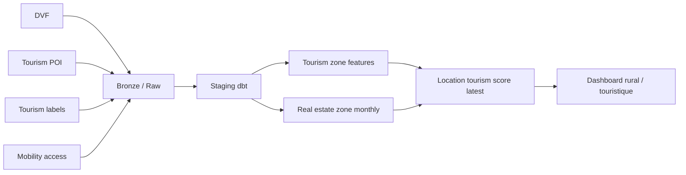

# Cadrage de projet data - location saisonniere rurale et touristique

## Positionnement

Le projet est recentre sur une question plus robuste que "ou lancer un Airbnb" :

**"Quelles communes rurales, naturelles ou touristiques offrent le meilleur potentiel pour un projet de location saisonniere, compte tenu du coût d'entree, de l'attractivite territoriale, de l'accessibilite et de la pression concurrentielle ?"**

Ce repositionnement est mieux adapte a la France rurale, ou les donnees Airbnb publiques sont trop partielles pour servir de socle national.

## Objectif business

Identifier et classer les zones rurales / touristiques les plus interessantes pour:
- acheter une residence secondaire a exploiter en location saisonniere,
- acheter un bien ancien a renover,
- evaluer une opportunite de gite, maison de vacances ou petite unite touristique.

## Objectif analytique

Construire un score de potentiel locatif touristique par commune a partir de cinq piliers:
- **coût d'entree** via DVF,
- **attractivite touristique** via POI, labels et amenites,
- **accessibilite** via temps d'acces et proximite des hubs,
- **intensite / saisonnalite** via population saisonniere et signaux touristiques,
- **pression concurrentielle** via proxies d'hebergements.

## Niveau geographique recommande

Le niveau principal devient la **commune**. C'est le bon compromis pour:
- les zones rurales,
- les labels territoriaux,
- DVF,
- les points d'interet touristiques,
- l'accessibilite calculee.

Le projet peut ensuite ajouter:
- `H3` pour les zones touristiques denses,
- sections cadastrales pour des zooms fonciers,
- departement / region pour le benchmark macro.

## Sources de donnees cibles

### Sources coeur
- `DVF` pour les prix et le ticket d'entree.
- `DATAtourisme` ou export POI equivalent pour les attractions.
- tables de labels communaux: littoral, montagne, lacs, parcs, stations classees, villages classes.
- table d'accessibilite: temps vers gare, autoroute, aeroport, metropole.

### Sources optionnelles
- `seasonal_population` pour la saisonnalite.
- `tourism_supply_proxy` pour la concurrence.
- `BAN` et references geo pour la normalisation.
- `Cadastre` pour le foncier.

## Schema conceptuel

## Modele de score

Le score final n'est plus un proxy de revenu Airbnb observe. Il devient un **score de potentiel touristique exploitable**.

### Variables clefs
- `median_price_m2_bati`
- `benchmark_entry_ticket_est`
- `tourism_poi_count`
- `nature_poi_count`
- `heritage_poi_count`
- `is_littoral`
- `is_mountain`
- `is_natural_park`
- `is_classified_tourism_station`
- `minutes_to_gare`
- `minutes_to_motorway`
- `minutes_to_airport`
- `drive_time_to_metropole`
- `seasonal_population_ratio`
- `accommodation_count`

### Composantes du score
- **Attractivite**: nombre et qualite des POI, labels, patrimoine, nature.
- **Accessibilite**: facilite d'acces depuis la demande potentielle.
- **Nature / premium rural**: littoral, montagne, lac, parc, village classe.
- **Saisonnalite**: potentiel fort ou marche stable selon le profil investisseur.
- **Competition**: signal de saturation ou de profondeur de marche.
- **Affordability**: ticket d'entree immobilier.

## Profils investisseurs

### Prudent
Cherche des communes accessibles, pas trop cheres, avec une saisonnalite tolerable.

### Rendement
Cherche les zones les plus touristiques meme si elles sont plus saisonnieres.

### Nature premium
Cherche les zones a forte desirabilite rurale: montagne, littoral, lac, parc, patrimoine.

### Petit budget
Cherche le meilleur compromis entre coût d'entree et attractivite minimale.

## KPI a exposer

- `median_price_m2_bati`
- `benchmark_entry_ticket_est`
- `tourism_potential_proxy`
- `access_score`
- `nature_score`
- `seasonality_intensity`
- `competition_proxy`
- `score_prudent`
- `score_rendement`
- `score_nature_premium`
- `score_petit_budget`

## Logique dashboard

Le dashboard doit permettre de:
- filtrer par region, departement, type de territoire,
- comparer plusieurs communes,
- visualiser le ticket d'entree vs potentiel touristique,
- afficher un top des communes selon le profil,
- expliquer les composantes du score.

## Ce que change ce repositionnement

### Avant
- projet tres dependant d'Inside Airbnb,
- bonne couverture urbaine,
- faible pertinence sur la campagne.

### Apres
- projet base sur des signaux territoriaux beaucoup plus generiques,
- bien plus credible pour les zones rurales et naturelles,
- meilleure robustesse nationale,
- score plus defendable en soutenance pour une logique "investissement touristique rural".

## Roadmap conseillee

1. Charger `DVF`.
2. Construire un premier `tourism_poi.csv`.
3. Construire `tourism_labels.csv`.
4. Construire `mobility_access.csv`.
5. Lancer le pipeline.
6. Produire le premier ranking par commune.
7. Ajouter `seasonal_population` et `tourism_supply_proxy`.

## Sources actuelles utiles

- [DVF sur data.gouv.fr](https://www.data.gouv.fr/datasets/demandes-de-valeurs-foncieres/)
- [DATAtourisme](https://www.datatourisme.gouv.fr/)
- [INSEE - Base permanente des equipements](https://www.insee.fr/fr/statistiques/3568638)
- [INPN - espaces proteges](https://inpn.mnhn.fr/telechargement/cartes-et-information-geographique/espaces-proteges)
- [SNCF Open Data](https://ressources.data.sncf.com/)

## Conclusion

Le bon angle n'est plus "scorer Airbnb partout", mais **scorer le potentiel d'une location saisonniere rurale ou touristique la ou le territoire donne de vrais signaux de desirabilite, d'acces et de viabilite economique**. C'est un meilleur sujet pour la campagne, et un sujet plus solide techniquement.
